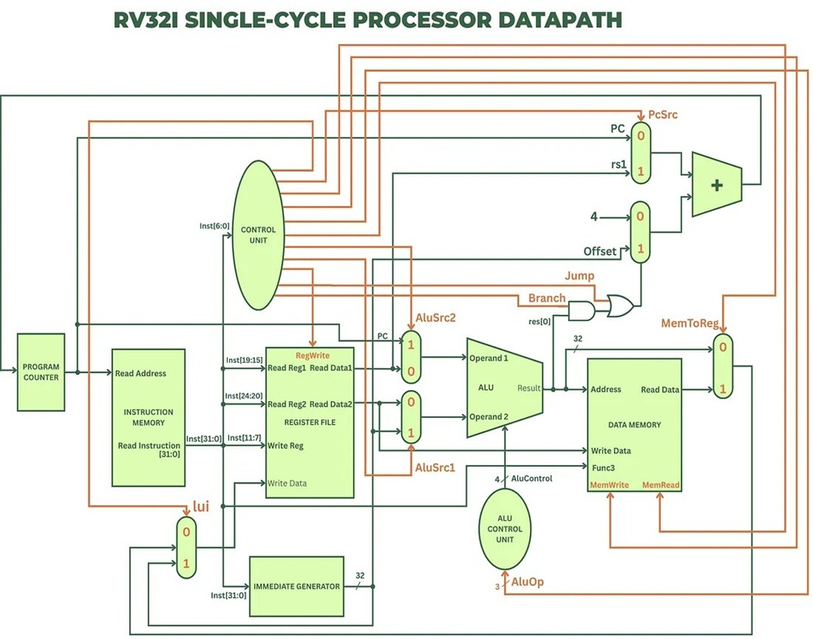
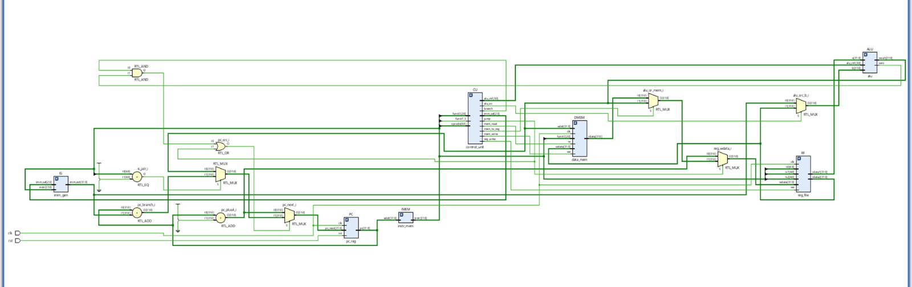
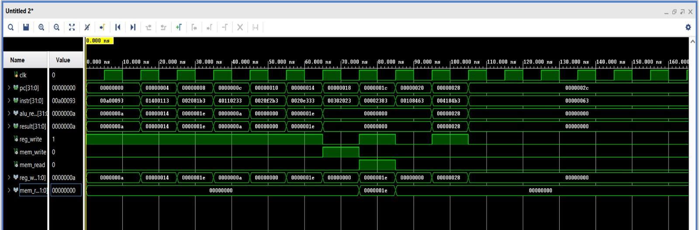

# 32-bit RISC-V Processor

A custom-designed 32-bit RISC-V Processor implemented in Verilog HDL and simulated using Xilinx Vivado. This project demonstrates the implementation of a basic single-cycle RISC-V architecture including instruction execution, ALU operations, memory access, and control logic.

---

## Overview

This project implements a 32-bit RISC-V processor capable of executing fundamental RISC-V instructions. The processor consists of several modules such as the Control Unit, ALU, Datapath, and Memory Unit.

The design was developed and verified using Verilog HDL and simulated in Xilinx Vivado.

---

## Features

- 32-bit RISC-V Architecture
- Single-Cycle Processor Design
- Arithmetic and Logic Operations
- Register File Implementation
- Instruction Memory and Data Memory
- Control Unit for Instruction Decoding
- Branch and Jump Support
- Simulation and Verification using Vivado

---

## Architecture

Insert the processor architecture diagram below.

---

## RTL Schematic

RTL schematic generated from Vivado.

---

## Simulation Waveform

Functional verification waveform captured from Vivado simulation.

---

---

## Project Structure

---

## Modules Description

### ALU & Memory Module
- Performs arithmetic and logical operations.
- Interfaces with data memory.

### Control Unit
- Decodes instructions.
- Generates control signals for datapath operation.

### Datapath Unit
- Implements register file, multiplexers, ALU connections, and program counter logic.

### Top Module
- Integrates all processor modules.

### Testbench
- Provides stimulus and verifies processor functionality through simulation.

---

## Tools Used

- Verilog HDL
- Xilinx Vivado
- Git & GitHub

---

## Simulation Steps

1. Open Xilinx Vivado.
2. Create a new RTL project.
3. Add all Verilog source files.
4. Add `program.hex` memory initialization file.
5. Set `riscv_top.v` as top module.
6. Add `tb_riscv.v` as simulation source.
7. Run Behavioral Simulation.
8. Observe waveform results.

---

## Future Improvements

- Pipelined RISC-V Processor
- Hazard Detection Unit
- Forwarding Unit
- Cache Memory Integration
- Support for Additional RISC-V Instructions

---

## Author

**Rakesh Dandoti**

B.Tech (ECE)

Skills:
- Verilog HDL
- Embedded Systems
- Digital Design
- FPGA Development
- Web Development

GitHub: https://github.com/rakeshd21

---
## Contributors

- Kiran Achari
- Kirankumar Patil
